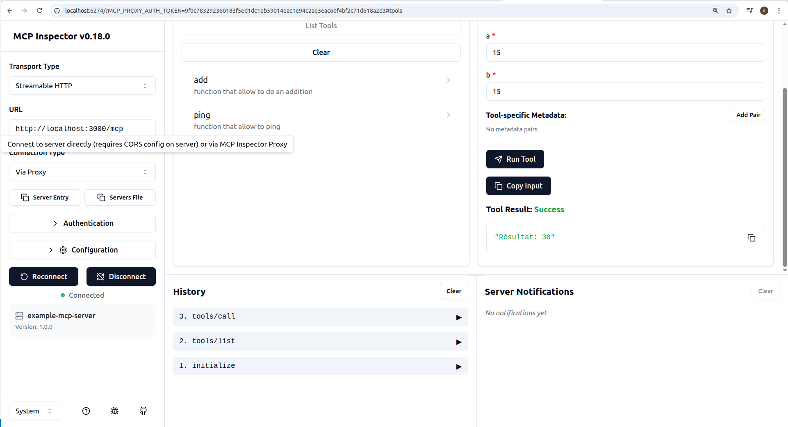

# mcp
# Sources
## video
    https://www.youtube.com/watch?v=kXuRJXEzrE0
    https://www.youtube.com/watch?v=gKkTpVeqdcY

## sample
    https://github.com/worryzyy/HowToCook-mcp/blob/master/src/index.ts

## Best video
    https://www.youtube.com/watch?v=nTPeM8l3zTg //Best video

## Sample for streamable Http
https://github.com/modelcontextprotocol/typescript-sdk/blob/main/examples/server/src/simpleStreamableHttp.ts

## Best Sample for streamable Http stateless like mentioned in video https://www.youtube.com/watch?v=nTPeM8l3zTg
https://github.com/modelcontextprotocol/typescript-sdk/blob/main/examples/server/src/simpleStatelessStreamableHttp.ts

# Pour faire un test
* start => node server.js
* start => npx @modelcontextprotocol/inspector 

